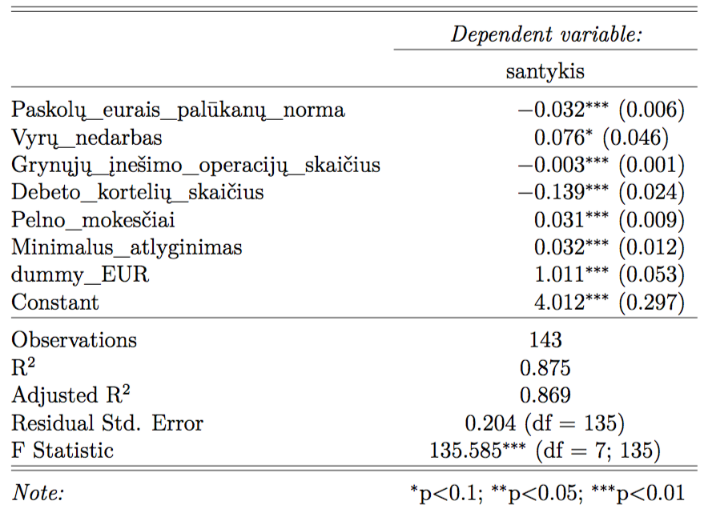
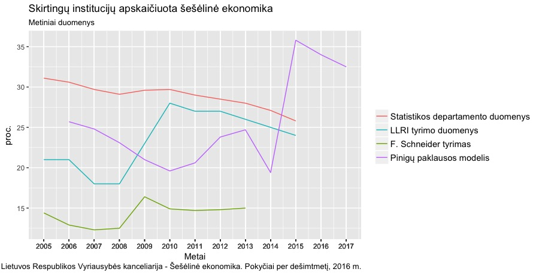

```{r setup, include=FALSE}
knitr::opts_chunk$set(echo = FALSE)
```

## Darbo tikslas ir uždaviniai

- Įvertinti Lietuvos šešėlinę ekonomiką
- Nustatyti pagrindinius jos mastą lemiančius veiksnius


## Šešėlinė ekonomika. Kylančios problemos

- Samprata nėra apibrėžiama vienareikšmiškai
- Dėl neapibrėžtumo sunku parinkti tinkamą būdą masto vertinimui
- Visi tyrimo metodai turi trūkumų


## Pinigų paklausos metodas 1/4

- Tai vienas populiariausių naudojamų metodų šešėlinės ekonomikos dydžiui tirti
- Galioja prielaidos, kad pinigų santykis C/M2[^m2] yra veikiamas legaliais ir nelegaliais faktoriais ir kad baziniais metais šešėlinės ekonomikos dydis yra nulinis
- Pajamos šešėlinėje ekonomikoje kinta taip pat kaip ir oficialioje
- Šešėlinė ekonomika įvertinama apskaičiavus pinigų paklausos skirtumą žemiausiame ir aukštesniame mokesčių taške.

[^m2]: Čia C - grynieji pinigai, o M2 – grynieji pinigai apyvartoje, vienadieniai indėliai bankuose ir kiti trumpalaikiai indėliai šalies ir užsienio valiuta.


## Pinigų paklausos metodas 2/4

- Grynųjų pinigų ir indėlių santykio kitimas laike:

\begin{equation}
\ln\left(\frac{C}{k}\right)_t = \alpha^{\prime}Z_t + \beta T_t \label{eq:e1} ,
\end{equation}

- Perrašome taip:

\begin{equation}
\hat{C}_t = e^{\hat{\alpha}^{\prime}Z_t + \ln k_t + \hat{\beta} T_t} \label{eq:e3} .
\end{equation}

- Pinigų paklausos skirtumas esant žemiausiai mokesčių reikšmei ir mokesčių naštai keičiantis kasmet:

\begin{equation}
C_t^U = \hat{C_t} - \hat{C}_t ^{T_{t_0}} \label{eq:e5} ,
\end{equation}


## Pinigų paklausos metodas 3/4

- Bendros pajamos šešėlinėje ekonomikoje

\begin{equation}
Y_t^U = C_t^U \cdot V_t^U \label{eq:e6} .
\end{equation}

- pinigų kintamumas šešėlyje yra toks pats kaip ir oficialioje ekonomikoje, tai jis apskaičiuojamas taip:

\begin{equation}
V_t = \frac{Y_t}{M2_t - C_t^U} \label{eq:e7} ,
\end{equation}

- o bendros pajamos šešėlyje:

\begin{equation}
Y_t^U = V_t \cdot C_t^U \label{eq:e8} .
\end{equation}


## Pinigų paklausos metodas 3/4

- Iš \eqref{eq:e7} ir \eqref{eq:e8} lygčių gauname šešėlinės ekonomikos dydį, kurį išreiškiame kaip
procentinę dalį nuo stebimo BVP:

\begin{equation}
\frac{Y_t^U}{Y_t} = \frac{Y_t \cdot C_t^U}{(M2_t - C_t^U) \cdot Y_t} = \frac{C_t^U}{M2_t - C_t^U} \label{eq:e9} .
\end{equation}


## Pinigų paklausos modelis Lietuvai

- 36 kintamieji
- Duomenų deagregavimas
- Vienetinės šaknies tikrinimas (PP testas, KPSS testas)
- Koreliacijos tikrinimas
- ar yra taikomos regresijos modelio prielaidos ir patikrinti dispersijos mažėjimo daugiklio tikrinimas (VIF)
- Pseudokintamojo įvedimas modeliuojant valiutos pasikeitimą iš litų į eurus


## Daugianarė regresija




## Rezultatų palyginimas




## Išvados

Reikšmingiausi veiksniai:

- paskolų palūkanų pokytis
- vyrų nedarbo lygio pokytis
- debeto kortelių skaičius 
- pelno mokesčiai
- minimalus atlyginimo pokytis
- grynųjų pinigų įnešimo į bankomatą operacijų skaičius pokytis


## Pabaiga

Ačiū už dėmesį

